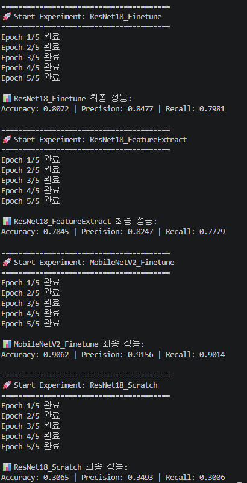
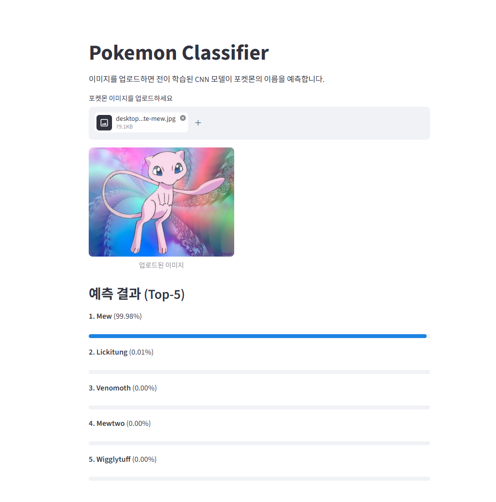

# Pokemon Classification with Transfer Learning

## 개요

주어진 포켓몬 이미지(7,000장, 150개 클래스)를 입력받아 포켓몬의 이름을 분류하는 딥러닝 프로그램.
사전 학습된(Pre-trained) CNN 모델을 활용한 전이 학습(Transfer Learning)을 적용하고 성능을 비교 분석.
Streamlit을 이용하여 사용자가 이미지를 업로드하면 포켓몬을 예측하는 GUI 데모 제공.

---

## Demo

**학습**

**GUI 구동 화면**

 

---

## 동작 과정 

1. 데이터 전처리 및 분할 (training.py)
   - torchvision.datasets.ImageFolder를 사용하여 데이터를 로드
   - scikit-learn의 train_test_split을 활용하여 전체 데이터를 Train 80%, Validation 20%로 클래스 비율에 맞춰 분할
   - Random Crop, Horizontal Flip 등의 데이터 증강(Data Augmentation) 적용

2. 모델 셋업 및 전이 학습 (Transfer Learning)
   - ImageNet으로 사전 학습된 가중치를 불러와 포켓몬 분류에 맞게 출력 레이어(head) 수정
   - 4가지 실험 설정 구성: ResNet18 (Fine-tuning / Feature Extraction / Scratch), MobileNetV2 (Fine-tuning)

3. 모델 학습 및 평가
   - 각 모델을 동일한 Epoch(5) 동안 학습
   - Validation 데이터를 통해 Accuracy, Precision, Recall 지표 산출 및 비교

4. GUI 애플리케이션 (test.py) - `streamlit run test.py`으로 실행 
   - 가장 성능이 우수한 모델(MobileNetV2)의 가중치를 불러옴
   - Streamlit을 통해 이미지를 업로드받고 예측 확률 Top-5를 화면에 출력

---

## 실험 결과 (Experiments & Evaluation)

총 4가지의 실험 설정을 구성하여 성능을 비교.

| Experiment Setup | Accuracy | Macro Precision | Macro Recall |
|------------------|----------|-----------------|--------------|
| **ResNet18 (Fine-tuning)** | 0.8072 | 0.8477 | 0.7981 |
| **ResNet18 (Feature Extraction)** | 0.7845 | 0.8247 | 0.7779 |
| **MobileNetV2 (Fine-tuning)** | **0.9062** | **0.9156** | **0.9014** |
| **ResNet18 (Scratch)** | 0.3065 | 0.3493 | 0.3006 |

---

## 결론

* 전이 학습의 효과 : 사전 학습 가중치 없이 처음부터 학습한 ResNet18(Scratch)은 약 30%의 매우 낮은 성능을 보인 반면, ImageNet 사전 학습 가중치를 활용하여 Fine-tuning한 모델들은 모두 거의 80% 이상의 높은 성능을 기록함.
* Fine-tuning vs Feature Extraction : Backbone 네트워크의 가중치를 고정시킨 Feature Extraction보다 전체 가중치를 포켓몬 데이터에 맞게 미세 조정한 Fine-tuning 방식이 본 데이터셋에서는 더 적합했음.
* 최우수 모델 : 상대적으로 가벼운 파라미터 구조를 가진 MobileNetV2가 약 90%로 가장 높은 정확도를 달성하여 효율성과 분류 성능을 모두 만족함.

---

## References

  * Course : Deep Learning for Computer Vision (Prof. Sunglok Choi / https://mint-lab.github.io/)
  * Dataset : 7,000 Labeled Pokemon (# of classes: 150), Kaggle
  * Framework : PyTorch, Streamlit
